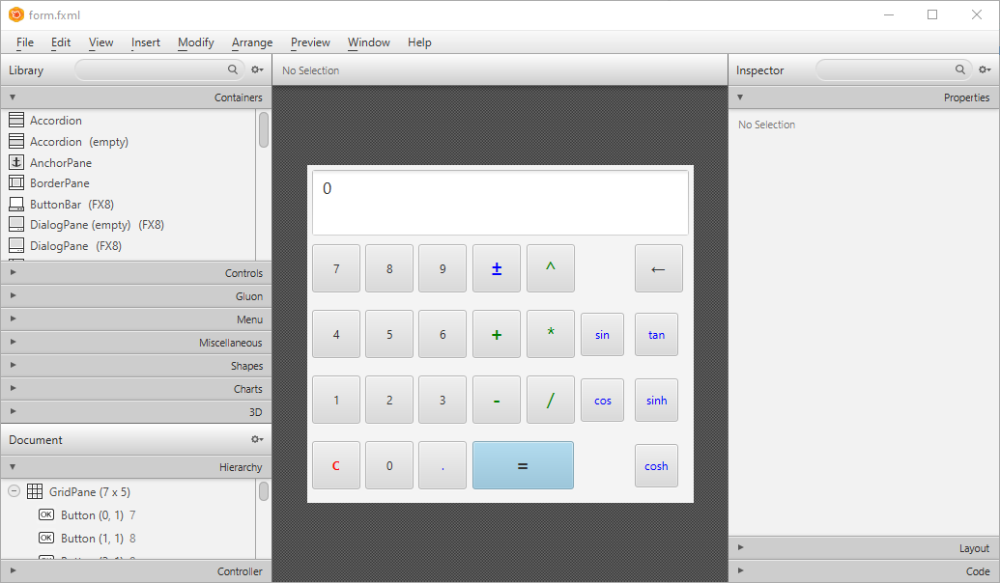
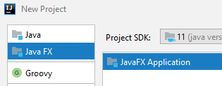
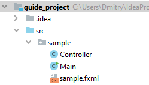
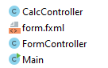
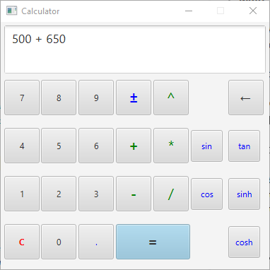

# Простой калькулятор на JavaFX

## Структура

- [1. Создание формы](#1--)
- [2. Создание проекта в IDEA](#2----idea)
- [3. Написание кода](#3--)
    * [Main](#main)
    * [CalcController](#calccontroller)
    * [FormController](#formcontroller)
    * [form.fxml](#formfxml--)

> **Примечание: в данном примере логика калькулятора описана в отдельном классе.
В целом, большой необходимости в этом нет, для простоты весь код можно писать в контроллере формы.
Однако, при желании использования функционала горячих клавиш, это может упростить работу.
Да и код более структурированный получается.**

## 1. Создание формы
Для создания интерфейса калькулятора поспользуемся программой SceneBuilder. 
В качестве основы используем **GridPlane** размерами 7x5. 
В качестве "экрана" калькулятора добавим **TextArea**, 
в качестве кнопок несколько **Button**. Визуальный стиль элементов настраиваем по своему вкусу.
В примере *синим* цветом обозначены унарные операции, *зеленым* - бинарные.
Кнопка "C" обнуляет значение.

**Примечания:**
- Чтобы добавить колонку/столбец в сетку (GridPlane), достаточно отпустить нужный
элемент немного правее/ниже рамки
- Чтобы растянуть TextArea не несколько столбцов, на панели справа во вкладке "Layout"
необходимо повысить значение параметра "Column Span" (до количества клеток, которые элемент
должен занимать)
- Размеры кнопок можно изменить на панели справа во вкладке "Layout". Параметры "Pref Width" и 
"Pref Height"
- Текст кнопок можно изменить на панели справа или двойным кликом на саму кнопку

## 2. Создание проекта в IDEA
Запустим IDEA. Создадим новый проект типа "JavaFX Application"

Структура созданного проекта должна выглядеть примерно так:

Интересующие нас файлы:
- **Controller**. В нем будет вся логика взаимодействия пользователя с интерфейсом
- **sample.fxml**. В этом файле необходимо вставить созданный в SceneBuilder интерфейс
- **Main**. Нужен будет только для настройки некоторых параметров создаваемого окна приложения

Также создадим новый класс **CalcController**, где будем описывать логику работы самого калькулятора.

Для удобства переименуем стандартные файлы:
- **Controller** в **FormController**
- **sample.fxml** в **form.fxml**

Должно получиться примерно так:

## 3. Написание кода

#### Main
Начнем с файла **Main**. В функции `start` заменим название окна (вызов `primaryStage.setTitle`),
его размеры (`new Scene(root, 380, 350)`), а также отключим пользователю возможность
изменять эти размеры (`primaryStage.setResizable(false)`). 

Новый вид функции:

    public void start(Stage primaryStage) throws Exception {
        Parent root = FXMLLoader.load(getClass().getResource("form.fxml"));
        primaryStage.setTitle("Calculator"); // Название
        primaryStage.setScene(new Scene(root, 380, 350)); // Размеры
        primaryStage.setResizable(false); // Запрещаем менять размеры
        primaryStage.show();
    }
    
#### CalcController
Напишем логику работы калькулятора. 
Так как одной из целью является возможность вещественных вычислений, для хранения левого
и правого числа используем класс `StringBuilder`
 *(хотя изначально использовались переменные типа `int` и код выглядел намного приличнее.
 Однако нормального способа "поциферного" заполнения `double`/`float` я не придумал)*.
 Также создадим переменную типа `char`, где будем хранить текущий операнд (*, /, +, - и т.д.) и
 переменную типа `String`, куда будем помещать текст возникшей ошибки в случае необходимости.
  
     private StringBuilder leftValue = new StringBuilder("0");
     private StringBuilder rightValue = new StringBuilder();
     private char opValue;
     private String Error = null;
     
Далее начинаем делать функции. Полный код функций приводить не буду, а лишь опишу их:

(*Код всех функций можно посмотреть в файле [CalcController.java](../src/calc/CalcController.java)*)

- `void AppendDigit(int digit)`

Принимает в качестве аргумента число от 0 до 9, добавляет в `leftValue` или `rightValue` 
переданное число

- `void SetOperand(char operand)`

Меняет значение переменной `opValue` (операнда). В случае передачи сивола `=`, производит вычисление
выражения (при наличии возможности). Также при наличии введенных обоих чисел и передачи любого
другого бинарного операнда, произодит вычисление выражения и подставляет переданный операнд.

- `String GetScreenText()`

Генерирует строку с текстом для вывода на "экран" калькулятора. В случае `Error != null` возвращает
значение этой переменной.

- `void Reset()`

Возвращает значения всех переменных контроллера в исходные.

- `void RemoveDigit()`

Удаляет последнее введенное значение (цифру, операнд)

- `void PlusMinus()`

Производит операцию унарного минуса над `leftValue` или `rightValue`

- `void MakeBinarySolve()`

Используется для вычисления бинарных выражений (*, /, +, -, ^). В случае ошибки вызывает `Reset` 
и заполняет `Error` текстом ошибки исключения.

- `void MakeUnarySolve(String op)`

Как `MakeBinarySolve`, но для функций (sin, cos, sinh и т.д.). Принимает на вход название
соответствующей функции. Обработка ошибок работает аналогично.

- `private void writeSolveAnswer(Double value)`

Приватная функция, используемая в `MakeBinarySolve` и `MakeUnarySolve`.
Заполняет значение `leftValue`, очищает `rightValue`. 
В случае результата `Infinity` или `NaN` заполняет `Error` соответствующей ошибкой.

- `void AddDot()`

Добавляет вещественный разделитель (`.`) к `leftValue` или `rightValue`.

#### FormController
Начнем описывать логику работы с интерфейсом.

(*Полный код можно посмотреть в файле [FormController.java](../src/calc/FormController.java)*)

Импортируем стандртные классы:

    import javafx.event.ActionEvent; // 1
    import javafx.fxml.FXML; // 2
    import javafx.scene.control.Button; // 3
    import javafx.scene.control.TextArea; // 4
    import javafx.scene.input.KeyEvent; // 5
    
Первые три импорта нужны для функций-обработчиков нажатий на кнопки,
четвертый для объявления переменной "экрана" (Который у нас **TextArea**), 
пятый для добавления возможности "горячих" клавиш (по желанию).

Создадим поля класса:

    public TextArea calcScreen; // Ссылка на наш "экран", куда будет выводить информацию
    private CalcController calcController = new CalcController(); // Ранее созданный контроллер
    
Создадим функцию для удобного обновления "экрана":

    private void updateScreen() {
        calcScreen.setText(calcController.GetScreenText());
    }
    
Все остальные (кроме одной) функции будут являться обработчиками события `onAction`. 
Шаблон таких функций:

    @FXML
    private void functionName(ActionEvent event) {
        Button btn = (Button) event.getSource(); // Получаем ссылку на объект
    }
    
    
**Начинаем создавать обработчики нажатий:**

Добавляем на все кнопки с цифрами:

    @FXML
    private void onClickDigit(ActionEvent event) {
        Button btn = (Button) event.getSource(); // Получим ссылку на кнопку
    
        // Получаем первый символ текста кнопки и преобразуем его в число
        calcController.AppendDigit(btn.getText().charAt(0) - '0');
        
        updateScreen(); // Обновляем "экран"
    }
    
Добавляем на кнопку "C" (Сброс):

    @FXML
    private void onClickClear(ActionEvent event) {
        calcController.Reset();
        updateScreen();
    }
    
Добавляем на все бинарные операнды. Тут логика аналогична `onClickDigit`, 
за исключением отсутствия преобразования символа в число:

    @FXML
    private void onClickOperand(ActionEvent event) {
        Button btn = (Button) event.getSource();

        calcController.SetOperand(btn.getText().charAt(0));
        updateScreen();
    }
    
Добавляем к кнопке "стрелка влево" (стирание символа):

    @FXML
    private void onClickRemove(ActionEvent event) {
        calcController.RemoveDigit();
        updateScreen();
    }
    
Добавляем к "+-" (Унарный минус):

    @FXML
    private void onClickPlusMinus(ActionEvent event) {
        calcController.PlusMinus();
        updateScreen();
    }
    
Добавляем ко всем функциям (sin, cos, sinh):

    @FXML
    private void onClickUnaryOperand(ActionEvent event) {
        Button btn = (Button) event.getSource();

        calcController.MakeUnarySolve(btn.getText());
        updateScreen();
    }
    
Добавляем к кнопке `.`:

    @FXML
    private void onClickDot(ActionEvent event) {
        calcController.AddDot();
        updateScreen();
    }
    
Также по желанию можно добавить обработку нажатий клавиш, чтобы можно было использовать
клавиатуру для более удобного ввода. 
Для этого создаем функцию `private void onKeyPress(KeyEvent event)` и привязываем к параметру
`onKeyPressed` самого верхнего элемента (`GridPane`) в FXML файле (об этом далее).
Полный код функции можно посмотреть в файле `FormController.java`.

#### form.fxml (Привязываем события)

(*Полный код можно посмотреть в файле [form.fxml](../src/calc/form.fxml)*)

Теперь привяжем ранее созданные события к нашему интерфейсу. Откроем файл `form.fxml`.
**Если код ранее, созданный в SceneBuilder, не был вставлен в этот файл (с заменой),
необходимо сделать это.**

>**Примечание: все действия, описанные в данном подразделе можно сделать
>в SceneBuilder, во вкладке "Code" правого меню. Соотвественно, для параметра `onAction`
>используем параметр "On Action" (название функции указываем без `#`),
>для `fx:id` используем "fx:id". Единственное, что не было найдено - параметр контроллера
>(описание ниже)**

В первую очередь обратим внимание на элемент `GridPane`. Он является корневым в структуре файла.

Нам необходимо добавить параметр `fx:controller="calc.FormController"`, тем самым
обозначив контроллер для интерфейса (где `calc` - название пакета, `FormController` - название
класса). Также необходимо добавить обработчик нажатий на клавиатуру (если выполнялся пункт с
горячими клавишами): `onKeyPressed="#onKeyPress"`

Должно получиться примерно так:

    <GridPane maxHeight="-Infinity" maxWidth="-Infinity" minHeight="-Infinity" minWidth="-Infinity"
          onKeyPressed="#onKeyPress" prefHeight="350.0" prefWidth="400.0"
          xmlns="http://javafx.com/javafx/11.0.1" xmlns:fx="http://javafx.com/fxml/1"
          fx:controller="calc.FormController">
          
Теперь начинаем добавлять событие `onAction` к кнопкам (`Button`).

Пример добавления:

    <Button mnemonicParsing="false" onAction="#onClickDigit" 
        prefHeight="50.0" prefWidth="50.0" text="5" 
        GridPane.columnIndex="1" GridPane.rowIndex="2" />
    
В данном примере мы добавляем функцию `onClickDigit` к кнопке `5`.
Аналогично добавляем ранее созданные события ко всем остальным кнопкам формы.
Какую функцию куда добавлять описано в предыдущем пункте.

Последним этапом будет добавление параметра `fx:id="calcScreen"` объекту "экрана" нашего калькулятора.
Где `calcScreen` - имя ранее объявленного поля типа `TextArea` в контроллере формы.
Тем самым мы привязываем объект TextArea к объявленной в контроллере переменной,
что позволит нам взаимодействовать с ним из кода этого контроллера.
Должно получиться примерно так:

    <TextArea fx:id="calcScreen" editable="false" 
        prefHeight="200.0" prefWidth="200.0" text="0" 
        wrapText="true" GridPane.columnSpan="7">

**Готово. Пробуем запускать проект.**

